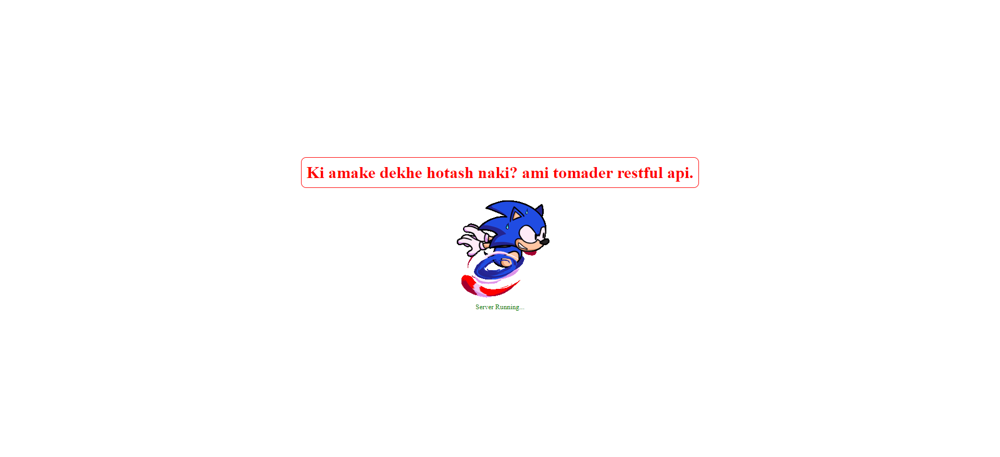

# turf-hub

.png>)

# Turf API Documentation

## Clone the repository to your local machine:

```bash
git clone https://github.com/Tahsin000/turfhub_backend.git

```

## Install dependencies using npm:

```bash
npm install
```

## Project start

```bash
npm start
```

## API Documentation URL `http://localhost:5000/api-docs`

## Base URL

The base URL for the API is `https://turf-hub.vercel.app/api`.

## Server Status Confirmation

You will see this to confirm whether the server has started

Server running url: [`https://turf-hub.vercel.app`](https://turf-hub.vercel.app)



## API documentation

### [Click ME](https://documenter.getpostman.com/view/30679746/2sAXjT1pSF)

# Turf Management System

## Project Overview

This Turf Management System allows users to book sports turf, manage activities, communities, and products. It is built using Node.js, Express, MongoDB, and Mongoose for schema management.

---

## API Documentation

### **Authentication Routes**

| Method | Endpoint                | Description                    |
| ------ | ----------------------- | ------------------------------ |
| POST   | `/auth/login`           | Logs in a user.                |
| POST   | `/auth/refresh-token`   | Refreshes user token.          |
| POST   | `/auth/forget-password` | Sends password recovery email. |
| POST   | `/auth/reset-password`  | Resets user password.          |

---

### **User Routes**

| Method | Endpoint            | Description              |
| ------ | ------------------- | ------------------------ |
| POST   | `/user/create-user` | Creates a new user.      |
| GET    | `/user/:id`         | Retrieves a single user. |
| PATCH  | `/user/:id`         | Updates user data.       |
| PATCH  | `/user/:id/role`    | Updates user's role.     |

---

### **Booking Routes**

| Method | Endpoint                  | Description                 |
| ------ | ------------------------- | --------------------------- |
| POST   | `/booking/create-booking` | Creates a new booking.      |
| GET    | `/booking/`               | Gets all bookings.          |
| GET    | `/booking/:id`            | Retrieves a single booking. |
| PATCH  | `/booking/:id`            | Updates booking details.    |
| DELETE | `/booking/:id`            | Deletes a booking.          |

---

### **Turf Routes**

| Method | Endpoint            | Description               |
| ------ | ------------------- | ------------------------- |
| POST   | `/turf/create-turf` | Creates a new turf.       |
| GET    | `/turf/`            | Retrieves all turfs.      |
| GET    | `/turf/:id`         | Retrieves a single turf.  |
| PATCH  | `/turf/:id`         | Updates turf information. |
| DELETE | `/turf/:id`         | Deletes a turf.           |

---

### **Timeslot Routes**

| Method | Endpoint                | Description                   |
| ------ | ----------------------- | ----------------------------- |
| POST   | `/timeslot/create-time` | Creates a new timeslot.       |
| GET    | `/timeslot/`            | Retrieves all timeslots.      |
| GET    | `/timeslot/:id`         | Retrieves a single timeslot.  |
| PATCH  | `/timeslot/:id`         | Updates timeslot information. |
| DELETE | `/timeslot/:id`         | Deletes a timeslot.           |

---

### **Community Routes**

| Method | Endpoint                      | Description                   |
| ------ | ----------------------------- | ----------------------------- |
| POST   | `/community/create-community` | Creates a new community.      |
| GET    | `/community/`                 | Retrieves all communities.    |
| GET    | `/community/:id`              | Retrieves a single community. |
| PATCH  | `/community/:id`              | Updates community details.    |
| DELETE | `/community/:id`              | Deletes a community.          |

---

### **Product Routes**

| Method | Endpoint                  | Description                  |
| ------ | ------------------------- | ---------------------------- |
| POST   | `/product/create-product` | Creates a new product.       |
| GET    | `/product/`               | Retrieves all products.      |
| GET    | `/product/:id`            | Retrieves a single product.  |
| PATCH  | `/product/:id`            | Updates product information. |
| DELETE | `/product/:id`            | Deletes a product.           |

---

---

## Installation

1. Clone the repository:

   ```bash
   git clone https://github.com/Tahsin000/turfhub_backend.git
   ```

2. Install dependencies:

   ```bash
   npm install
   ```

3. Set up environment variables:  
   Create a `.env` file in the root directory and add the following:

   ```bash
   PORT=4000
   MONGO_URI=your-mongodb-uri
   JWT_SECRET=your-jwt-secret
   ```

4. Run the application:
   ```bash
   npm run dev
   ```

---

## Features

- **User Management**: Manage user roles and authentication.
- **Booking System**: Users can book turf and timeslots.
- **Turf Management**: Manage turfs, activities, and facilities.
- **Product Management**: Manage sports products.
- **Community**: Users can engage in community-related discussions.

---

## License

This project is licensed under the MIT License - see the [LICENSE](./LICENSE) file for details.
